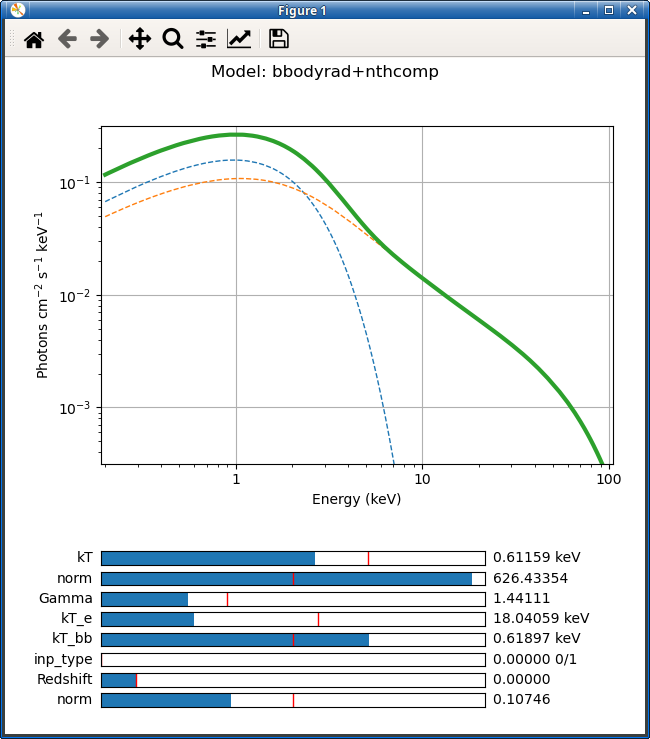

# pyXspecExplorer

pyXspecExplorer helps you to quickly plot and analyze XSPEC X-ray astrophysics models using [pyXSPEC](https://heasarc.gsfc.nasa.gov/xanadu/xspec/python/html/) and [Matplotlib Sliders](https://matplotlib.org/stable/gallery/widgets/slider_demo.html).

## Screenshot

## Usage:

Just run `python main.py` to experience with an example using `tbabs(bbodyrad+powerlaw)`.

You also can, for example:

- change the model, by running: `python main.py "tbabs(bbody+nthcomp)"`.
- change to `emodel` or `eemodel`, by running: `python main.py "tbabs(bbody+nthcomp)" emo`.

Another possibility is to compare two different models:

- just run `python compare.py` to experience comparing `bbodyrad` to `diskbb`.
- or give two arbitrary models as arguments `python compare.py "tbabs(nthcomp)" "nthcomp"`.

Please, do not hesitate to contact me asking for improvements, or Fork and Pull Request.
